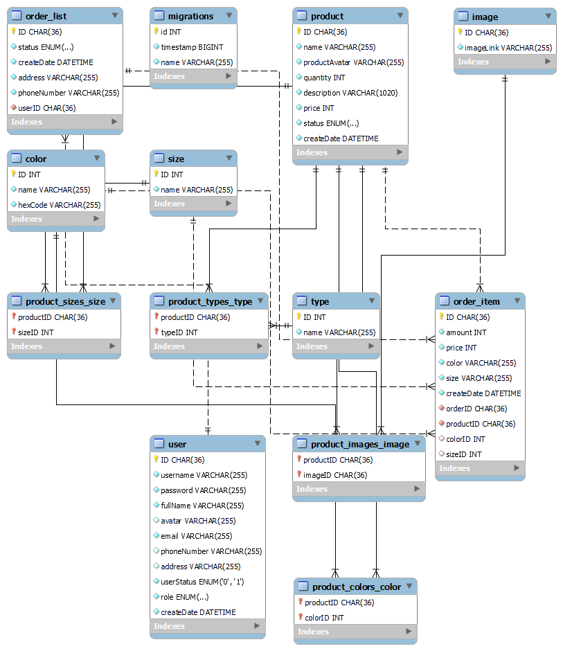
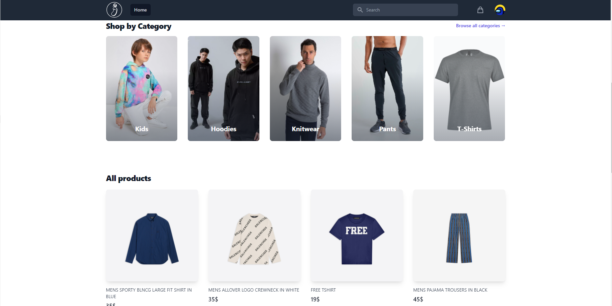
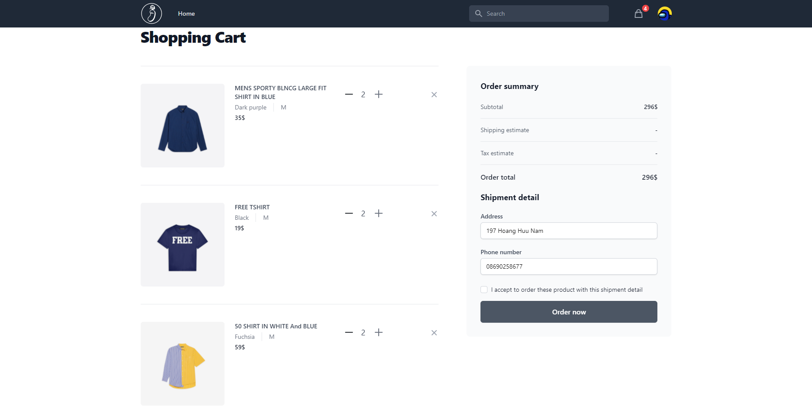
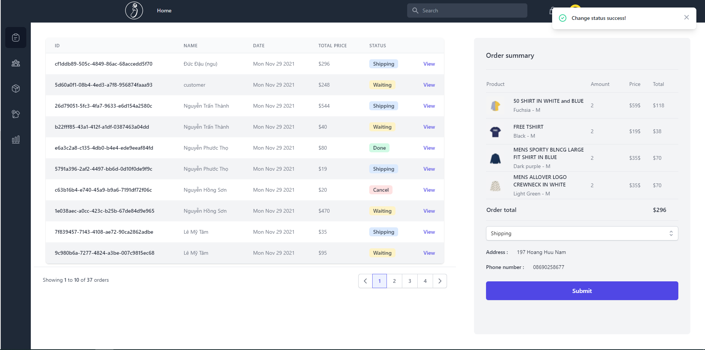
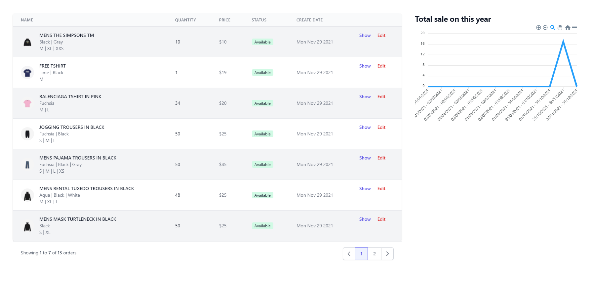
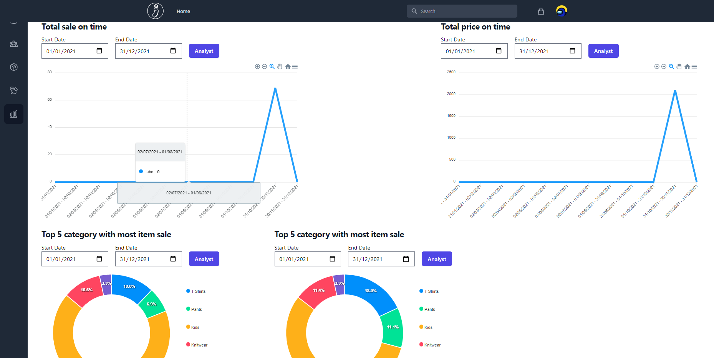
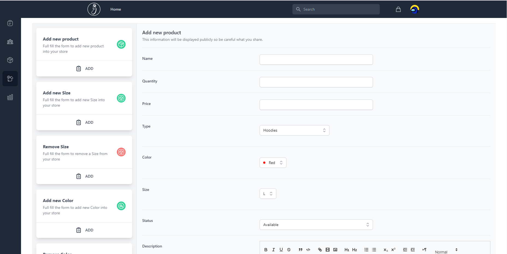
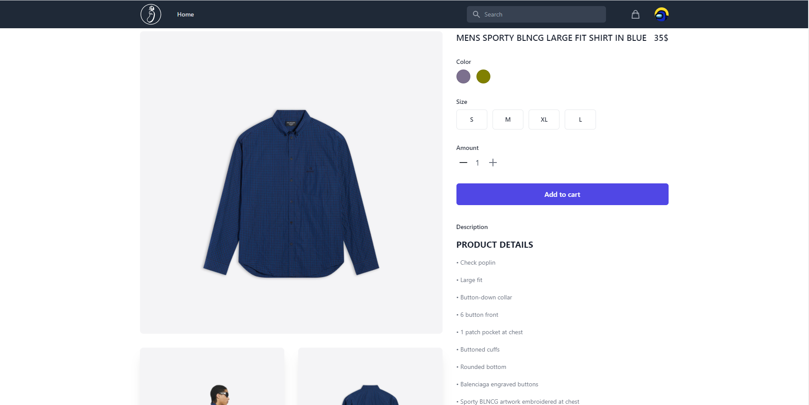

# Clothes shop

## Case Study

This website is an online clothes store which provides an online shopping cart for customer to add and purchase their order. Moreover, this system also provides services for administrator to manage product, view the order history and analyst data

## Feature by role

- ### Both Role Action

  - Login, register new account and logout
  - Update user information

- ### Customer Role Action

  - Search product book by name
  - Add, remove, change quantity, change shipping information product to cart
  - Checkout order
  - Review all order user have made
  - Checking each order information

- ### Admin Role Action
  - Include all action for a customer
  - Manage status of order, product information
  - ADD/DELETE type, color, size
  - View order, product, user
  - Analyst information and show by graph

## Technology

- Frontend
  - ReactJS + Typescript
  - Tailwind
- Backend
  - Express + Typescript
- Database
  - MYSQL + typeorm
- Deployment
  - Docker

## Team Member

- Đậu Lê Đức | Full-Stack
  - Gmail: dauleduc2@gmail.com
  - Linkedin: www.linkedin.com/in/ducdauu
  - Github: https://github.com/dauleduc2
  - Github: https://github.com/Banan-a
- Phạm Vĩnh Tài | Frontend
  - Gmail: kainesv86@gmail.com
  - Linkedin: www.linkedin.com/in/phamvinhtai
  - Github: https://github.com/kainesv86

## Project Picture

### Database Diagram

#### Relation Diagram

### Home Page

### Cart

### Order List order for admin

### Product list for admin

### Analyst data

### CRUD form

### Product In Detail

### dauleduc2 © 2021
